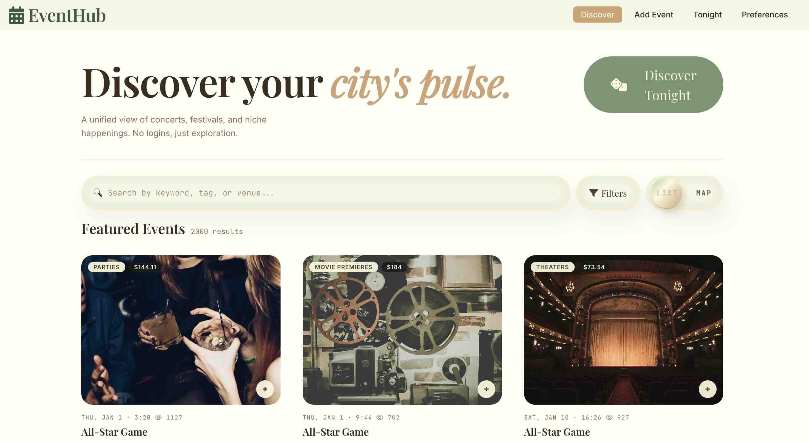
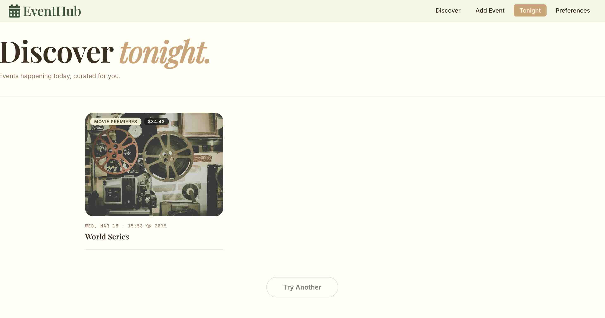
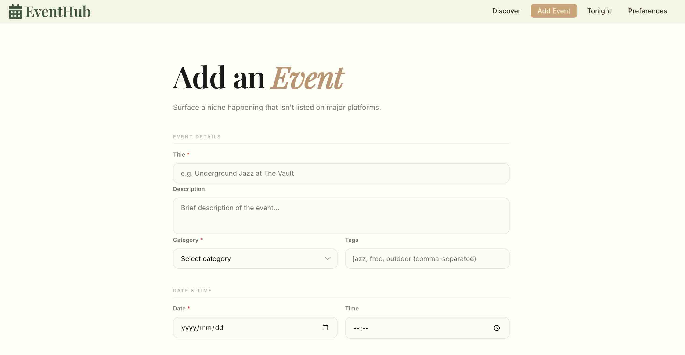
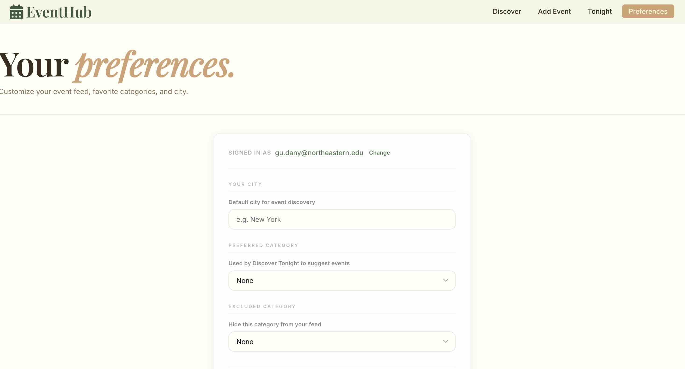

# EventHub


**Live Demo** [https://eventhub-t9pe.onrender.com](https://eventhub-t9pe.onrender.com)\
**Class Link** [Course Detail](https://johnguerra.co/classes/webDevelopment_online_spring_2026/)\
**Google Slides** [Slides](https://docs.google.com/presentation/d/1CL2inyHW98prUFMSg3S5qdhAforoC7HxkRlC5PD1B90/edit?usp=sharing)

---

## Prerequisites

- [Node.js](https://nodejs.org/) v18+
- A running MongoDB instance with connection URI
- Two terminal windows (one for backend, one for frontend)

---

## Design Mockup


---

## Screenshot





## Description:
Currently, public events—concerts, festivals, tech meetups, museum exhibitions, farmers markets—are fragmented across dozens of platforms: Eventbrite, Meetup, Facebook Events, university calendars, venue websites, and local city listings. Event seekers must manually check multiple sources, leading to missed opportunities and discovery fatigue.
To create a unified, no-login web application that aggregates public events from disparate platforms into a single searchable, filterable interface. It will allow anyone to discover what's happening in their city without platform-hopping, while enabling community contributors to manually add or import events from niche sources. Events are sourced through a curated mock dataset and community contributions via manual submission forms. (To support personalization without requiring account creation, users may optionally enter their email as an identifier to save preferences and favorites across sessions.)
The platform features an interactive map view, a randomized "Discover Tonight" recommendation engine, and a side-by-side event comparison tool—designed to transform passive browsing into active city exploration. The system prioritizes comprehensive coverage and powerful discovery over social features or persistent user identity.


## Project Structure

```
Web_Project3/
├── backend/
│   ├── server.js              # Express app, MongoDB connection
│   └── routes/
│       ├── event.js           # Event CRUD + filtering API
│       └── preference.js      # User preference API
└── frontend/
    └── src/
        ├── App.jsx            # Routing (/, /add, /preferences)
        ├── pages/
        │   ├── DiscoverPage.jsx
        │   ├── AddEventPage.jsx
        │   └── PreferencesPage.jsx
        │   └── DiscoverTonight.jsx
        ├── components/
        │   ├── shared/navbar.js
        │   └── events/        # EventCard, EventList, EventMap, FilterBar, SearchBar
        ├── hooks/             # useEvents, usePreferences
        ├── services/          # eventService, preferenceService
        └── styles/            # All CSS files
```

---

## Getting Started

### 1. Clone the repo

```bash
git clone <repo-url>
cd Web_Project3
```

### 2. Configure environment variables

Create a `.env` file inside the `backend/` folder:

```bash
# backend/.env
MONGO_URI=mongodb+srv://<user>:<password>@<cluster>.mongodb.net/project3
PORT=5001
```

### 3. Start the backend

```bash
cd backend
npm install
node server.js
```

The API will be available at `http://localhost:5001`.

### 4. Start the frontend

Open a second terminal:

```bash
cd frontend
npm install
npm start
```

The app will open at `http://localhost:3000`.

---

## API Endpoints

| Method | Endpoint | Description |
|--------|----------|-------------|
| GET | `/api/events` | List events (supports filters: `city`, `category`, `isFree`, `dateFrom`, `dateTo`, `platform`, `tags`, `search`, `random`, `page`, `limit`) |
| GET | `/api/events/:id` | Get single event |
| POST | `/api/events` | Create event |
| PUT | `/api/events/:id` | Update event |
| DELETE | `/api/events/:id` | Delete event |
| POST | `/api/events/:id/view` | Increment view count |
| GET | `/api/preferences/:email` | Get user preferences |
| POST | `/api/preferences` | Create preferences |
| PUT | `/api/preferences/:email` | Update preferences |
| PUT | `/api/preferences/:email/comparison` | Save comparison selection |
| DELETE | `/api/preferences/:email` | Delete preferences |

---

## Team

| Member | Scope |
|--------|-------|
| Danyan Gu | Events data layer, Discover page (list + map view), Add Event form |
| Xing Zhou | Preferences data layer, Discover Tonight, comparison tool|
